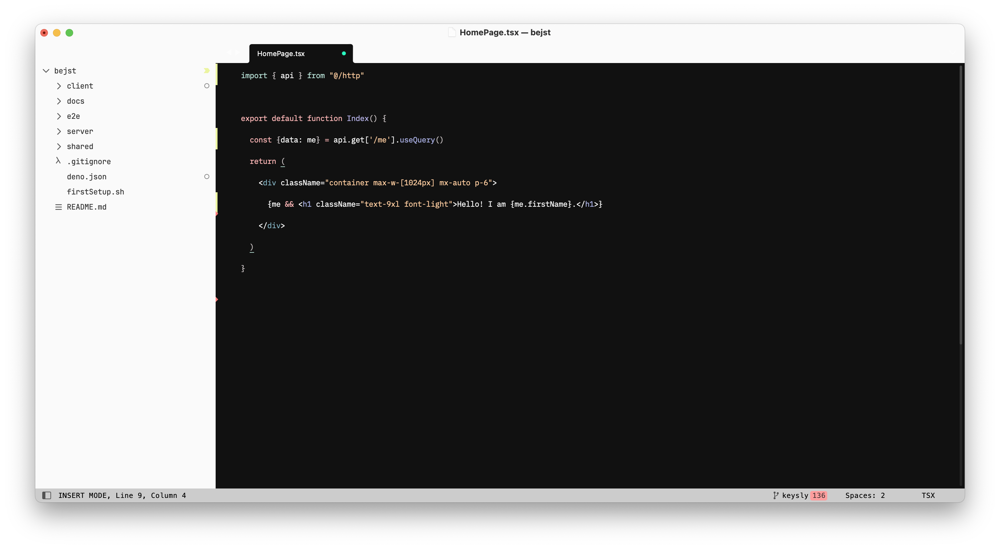
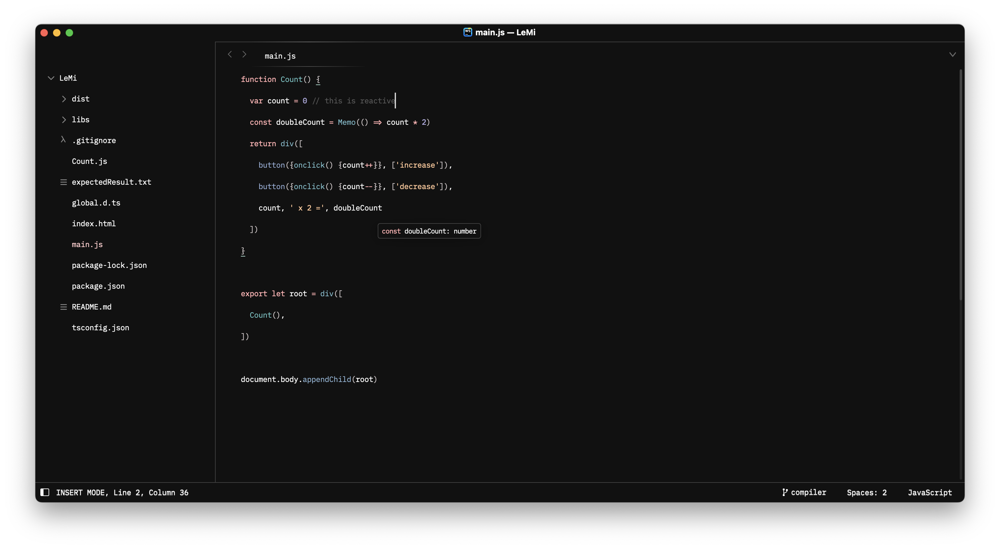

# Sone - Theme & Color Scheme for Sublime Text

From the command palette:
- select `UI: Select Color Scheme` and select `Sone`
- select `UI: Select Theme` and select:

### Sone

### Sone-Adaptive

